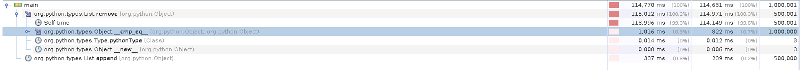
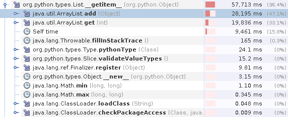

# Conjectures

## Remove TODO: fixa bilder från samma dator
### The times

The total time for 500.001 removes was 37.653ms where the most time was spent in self time, i.e the actual removal of items from the list. We tested removing the first element of the list 500.000 times and removing an item that didn't exist one time thus looking through the 500.000 elements 1 time.
### What to improve
As the most time spent was in the remove part of the code, implementing a datatype with better preformance there might be a good idea and the compare part isn't as important. If we compare the remove operator between ArrayList and LinkedList we can see that (, at least for our test), LinkedList is better with an complexity of O(1) instead of O(n) that ArrayList has.
### Our new results

After testing the LinkedList the times drastically worsened, the time increased five times, meaning that the switch to LinkedList was not the right choice for us.

## Slice
The workload for slice tests for head truncation, tail truncation, head and tail truncation, reversed head truncation, reversed tail truncation, slice given a step size and finally reversed step size slice. 

### 
Testing the python implentation of the workload gave an average of after 0.722780s 10 test runs.

Testing the java implementation of the workload gave an average of 2.917000s after 10 test runs. 

### Times

Using a profiler, the following image highlights where most time is spent: 

The total time spent was 57.713ms. The addition of elements took most of the time, otherwise we see that returning elements at a specified position and time spent in self, i.e., , consumed the most time. 

### Alternate implementation

The current implementation builds a new list for every operation. To enhance performance, a proposed alternative implementation would be to add start, stop and step as fields in the list class. By directly assigning start, stop and step values, when a slice is performed, you would essentially be making a copy of values directly rather than building a new list. 

### Results

The results are shown in the image below: 

As seen from the results... 

## Sort (proposal)
https://docs.google.com/document/d/1pNwL3n_IthYPKy0fBVM3L3VbA_JCZk1P8WWnoLRhXmE/edit?usp=sharing
