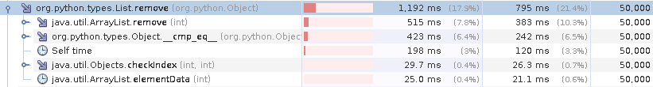
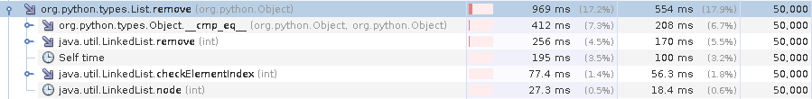

# Conjectures

## Remove TODO: fixa bilder från samma dator
### The times

The the workload was two steps, first adding 50.000 numbers and then removing them one by one from the first index. The second step was adding 50.000 new numbers and the removing them in the reverse order i.e. from the last index. The time we got was around 1.192 seconds for our remove operations, where in the List implementation around 500ms was using the ArrayList.remove, 400ms using the cmp and 200ms was selftime. 

### What to improve
The most time was spent just removing the elements from the list. Since we cant change the datatypes, the compare have to stay. If we look at different List types, ArrayList has a `O(n)` for removes in the list except for remvoing the last element where it is `O(1)`. LinkedList also has a `O(n)` complexity for removing in the list, however removing first OR last element from the list results in a `O(1)` complexity. Since removing the first element is a common operation it might be worth changing to.

### Our new results

After changing the List type we got a slight improvement, going down to ~950ms. The improvement was in the remove (compare and self-time staying the same), going from ~500ms to ~250ms cutting the times in half.  

## Slice
The workload for slice tests for head truncation, tail truncation, head and tail truncation, reversed head truncation, reversed tail truncation, slice given a step size and finally reversed step size slice. 

### 
Testing the python implentation of the workload gave an average of 0.722780s after 10 test runs.

Testing the java implementation of the workload gave an average of 2.917000s after 10 test runs. 

### Times

Using a profiler, the following image highlights where most time is spent: 

The total time spent was 57.713ms. The addition of elements took most of the time, otherwise we see that returning elements at a specified position and time spent in self, i.e., , consumed the most time. 

### Alternate implementation

The current implementation builds a new list for every operation. To enhance performance, a proposed alternative implementation would be to add start, stop and step as fields in the list class. By directly assigning start, stop and step values, when a slice is performed, you would essentially be making a copy of values directly rather than building a new list. 

### Results

The results are shown in the image below: 

As seen from the results... 

## Sort (proposal)
https://docs.google.com/document/d/1pNwL3n_IthYPKy0fBVM3L3VbA_JCZk1P8WWnoLRhXmE/edit?usp=sharing
