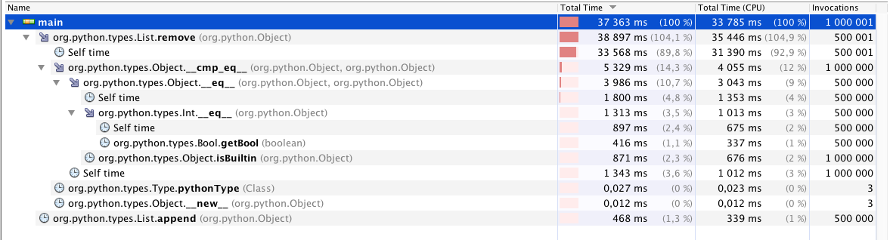

#Conjectures

## Remove
### The times

The total time for 500.001 removes was 37.653ms where the most time was spent in self time, i.e the actual removal of items from the list. We tested removing the first element of the list 500.000 times and removing an item that didn't exist one time thus looking throuhg the 500.000 elements 1 time. There were two operations 
